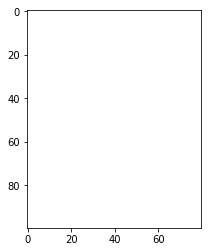

[TOC]

## Numpy是什么
强大的N维数组对象
NumPy 是一个运行速度非常快的数学库，主要用于数组计算，包含：

- 一个强大的N维数组对象 ndarray
- 广播功能函数
- 整合 C/C++/Fortran 代码的工具
- 线性代数、傅里叶变换、随机数生成等功能
- 导入numpy库并查看numpy版本


```python
import numpy as np
np.__version__
```

    '1.15.1'


打包库:<br/>
pip freeze > requirements.txt<br/>
pip install -r requirements.txt


```python
# pyplot 显示画图，数据分析与可视化
import matplotlib.pyplot as plt
img = plt.imread(r'C:\Users\zria\Desktop\ss.jpg')
type(img)
```
    numpy.ndarray


```python
img2 = img +100
plt.imshow(img2)
plt.show()
```


ndarray 对象由计算机内存中的一维连续区域组成，带有将每个元素映射到内存块中某个位置的索引方案。 内存块以按行(C 风格)或按列(FORTRAN 或 MatLab 风格)的方式保存元素。

## 一、创建ndarray
ndarray 中的每个元素在内存中都有相同存储大小的区域。
ndarray 内部由以下内容组成：
一个指向数据（内存或内存映射文件中的一块数据）的指针。
数据类型或 dtype，描述在数组中的固定大小值的格子。
一个表示数组形状（shape）的元组，表示各维度大小的元组。
一个跨度元组（stride），其中的整数指的是为了前进到当前维度下一个元素需要"跨过"的字节数。

### 1. 使用np.array()由python list 创建

numpy.array(object, dtype = None, copy = True, order = None, subok = False, ndmin = 0)
- order为创建数组的样式，C为行方向，F为列方向，A为任意方向
- subok 默认返回一个与基类类型一致的数组
- ndmin 指定生成数组的最小维度


参数列表为：[1,4,2,5,3],而不是多个元素
注意：
- numpy 默认ndarray的所有元素的类型是相同的
- 如果传进来的列表中包含不同的类型，则统一为同一类型，优先级：str >float >int


```python
n1 = np.array([3,1,4,5])
n1
```

    array([3, 1, 4, 5])


```python
n2 = np.array([[2,3,4,5],[3,4,6,7],[67,3,4,5]])
n2
```


    array([[ 2,  3,  4,  5],
           [ 3,  4,  6,  7],
           [67,  3,  4,  5]])


```python
n2.shape  # 显示数组的行数和列数
```


    (3, 4)


```python
n1.shape

```


    (4,)


```python
# 二维图片转为三维的数组，最后一维是颜色
img.shape
```


    (469, 469, 3)


```python
n4 = np.array([1,3,14,'python'])
n4
```


    array(['1', '3', '14', 'python'], dtype='<U11')


### 2. 从已有的数组创建数组
1) np.asarray  类似于np.array 但是np.asarray只有三个参数
`numpy.asarray(a, dtype = None, order = None)`
- a 任意形式的输入参数，可以是列表、列表的元组、元组的元组、多维数组、元组的列表
- dtype 数据类型，可选
- order 可选，"C""F"两个选项，分别代表，行优先和列优先，在计算机内存中的存储元素的顺序


2) np.frombuffer
用于实现动态数组，以流的形式读入转化成ndarray对象 

`numpy.frombuffer(buffer, dtype = float, count = -1, offset = 0)`
- buffer 可以是任意对象，会以流的形式读入，是字符串时，python3会默认是unicode类型，要转化成bytestring要加b
- count读取数量，默认-1表示读取所有数据
- offset 读取的起始位置

3) np.fromiter
从可迭代对象中建立ndarray对象，返回一维数组
`numpy.fromiter(iterable, dtype, count=-1)`


### 2. 使用np的routines函数
包含以下常见创建方法：<br/>
1) np.ones(shape.dtype=None, order='C') 创建都是1的数组


```python
np.ones(shape=(10,8), dtype=int)  # dtype表示类型 8行10列的数据， 默认是float64
```


    array([[1, 1, 1, 1, 1, 1, 1, 1],
           [1, 1, 1, 1, 1, 1, 1, 1],
           [1, 1, 1, 1, 1, 1, 1, 1],
           [1, 1, 1, 1, 1, 1, 1, 1],
           [1, 1, 1, 1, 1, 1, 1, 1],
           [1, 1, 1, 1, 1, 1, 1, 1],
           [1, 1, 1, 1, 1, 1, 1, 1],
           [1, 1, 1, 1, 1, 1, 1, 1],
           [1, 1, 1, 1, 1, 1, 1, 1],
           [1, 1, 1, 1, 1, 1, 1, 1]])


```python
ones = np.ones(shape =(100, 80, 3),dtype=float)

plt.imshow(ones)
plt.show()
```



2) np.zeros(shape, dtyoe=None, order='C')


```python
np.zeros((4,4)) # 创建都是0的数组
```


    array([[0., 0., 0., 0.],
           [0., 0., 0., 0.],
           [0., 0., 0., 0.],
           [0., 0., 0., 0.]])

3) np.full(shape, fill_value, dtype=None, order='C')


```python
np.full((10,10),fill_value=1024)
```


    array([[1024, 1024, 1024, 1024, 1024, 1024, 1024, 1024, 1024, 1024],
           [1024, 1024, 1024, 1024, 1024, 1024, 1024, 1024, 1024, 1024],
           [1024, 1024, 1024, 1024, 1024, 1024, 1024, 1024, 1024, 1024],
           [1024, 1024, 1024, 1024, 1024, 1024, 1024, 1024, 1024, 1024],
           [1024, 1024, 1024, 1024, 1024, 1024, 1024, 1024, 1024, 1024],
           [1024, 1024, 1024, 1024, 1024, 1024, 1024, 1024, 1024, 1024],
           [1024, 1024, 1024, 1024, 1024, 1024, 1024, 1024, 1024, 1024],
           [1024, 1024, 1024, 1024, 1024, 1024, 1024, 1024, 1024, 1024],
           [1024, 1024, 1024, 1024, 1024, 1024, 1024, 1024, 1024, 1024],
           [1024, 1024, 1024, 1024, 1024, 1024, 1024, 1024, 1024, 1024]])


4) np.eye(N, M=None, k=0, dtype=float) 对角线为1 其它位置为0


```python
np.eye(10) # 一元10次方程，单位阵是单位矩阵的简称，它指的是对角线上都是1，其余元素皆为0的矩阵。
```


    array([[1., 0., 0., 0., 0., 0., 0., 0., 0., 0.],
           [0., 1., 0., 0., 0., 0., 0., 0., 0., 0.],
           [0., 0., 1., 0., 0., 0., 0., 0., 0., 0.],
           [0., 0., 0., 1., 0., 0., 0., 0., 0., 0.],
           [0., 0., 0., 0., 1., 0., 0., 0., 0., 0.],
           [0., 0., 0., 0., 0., 1., 0., 0., 0., 0.],
           [0., 0., 0., 0., 0., 0., 1., 0., 0., 0.],
           [0., 0., 0., 0., 0., 0., 0., 1., 0., 0.],
           [0., 0., 0., 0., 0., 0., 0., 0., 1., 0.],
           [0., 0., 0., 0., 0., 0., 0., 0., 0., 1.]])

5) np.linspace(start, stop, num=50, endpoint=true, restep=False, dtype=None)
用于创建一个一维数组，数组是一个等差数列构成的
- stop为终止值，如果endpoint为true,该值包含于数列中
- num 生成的等步长的样本的数量，默认50
- retstep 如果为True，生成的数组中会显示间距，反之不显示


```python
# 将两个数，线性划分为num个点
# 获得想要的元素个数
np.linspace(0, 100, 20)
```

    array([  0.        ,   5.26315789,  10.52631579,  15.78947368,
            21.05263158,  26.31578947,  31.57894737,  36.84210526,
            42.10526316,  47.36842105,  52.63157895,  57.89473684,
            63.15789474,  68.42105263,  73.68421053,  78.94736842,
            84.21052632,  89.47368421,  94.73684211, 100.        ])


6) np.arange([start,]stop, [step,] dtype=None)
- step 步长，默认为1
- arange使用步长时无法确定获得元素的个数，由于浮点数的精度有限


```python
# 使用该方法创建ndarray时候，左闭右开
np.arange(0, 50, 50)
```

    array([0])


7) np.random.randint(low, high=None, size=None,dtype='l')


```python
np.random.randint(0, 150, size=5)
```

    array([108, 136,   9,  13,  46])


8) np.random.randn(d0, d1,...,dn)  标准正态分布


```python
np.random.randn(100)
```

    array([-0.52328493, -0.39230352, -0.56134216,  1.43989941, -1.05198749,
            0.12613986, -0.86343957, -0.83001941,  0.50887783, -0.25838879,
            0.06028105,  1.43790676, -1.08223898,  1.50108659, -0.81835983,
           -0.5005528 , -0.1171779 ,  0.66327912,  1.19549091, -0.42038049,
            1.12852705, -1.86574007,  0.70715848, -0.60431736,  0.48429466,
           -1.75660289,  1.56768543,  0.06019154, -1.4412436 ,  0.10540586,
            2.03621917, -0.54725087,  0.82699513, -0.59229524,  0.28015993,
           -0.26877373, -0.7997742 , -0.34502323, -0.13171042, -1.08616692,
           -0.23257367,  0.24453935,  1.01166534, -1.34288067,  0.32516981,
            0.38898442,  0.47929501, -0.57254158,  1.35432093,  0.73095195,
           -0.47706991, -0.10210469,  0.6252552 ,  0.33448192, -1.19233557,
           -0.10943443,  1.19952603, -0.40793741,  1.09202399, -1.22669696,
           -1.06595164,  0.21086308,  0.4710748 ,  0.54777371, -0.87966513,
            1.44227654,  1.2720762 , -0.66875622,  1.13437477, -0.81185549,
           -0.42718824,  1.55404252, -0.42743432,  0.23179723,  1.90483997,
           -0.22581292,  0.12393196,  0.43953447, -2.10183854,  0.15036586,
           -0.87522216,  0.30925392,  0.89983122, -0.27692547,  0.88995682,
            0.60712955, -0.57647255, -0.13082531, -1.76639471, -0.14732773,
            1.07788391, -1.32858596,  0.50185756, -1.10228551, -0.47946431,
            0.36147634, -0.56329074, -0.39259886, -1.46512777,  0.28774618])

9)np.random.normal(loc=0.0, scale=1.0, size=None)


```python
np.random.normal(loc=175, scale=1, size=100)
```

    array([173.28560726, 176.60257748, 172.5436762 , 173.53537839,
           174.62608962, 177.04748224, 172.85064167, 175.75642474,
           175.17627403, 174.53924733, 173.73347066, 173.17277363,
           175.08953618, 175.21733107, 173.56725615, 176.1096984 ,
           176.65158706, 176.06910492, 173.98520331, 176.34509824,
           175.09015884, 175.62746644, 174.0940874 , 174.55612586,
           174.64892984, 176.2103747 , 176.8984734 , 174.03780078,
           175.58817502, 173.32288131, 174.52384494, 174.02690509,
           175.74989925, 175.85095622, 174.0232566 , 172.37379215,
           175.09227152, 175.47768927, 174.53844761, 174.97848617,
           173.82732714, 176.29713699, 174.67419805, 176.40839607,
           175.86057737, 175.27233572, 174.9084846 , 176.67102857,
           174.07441515, 176.42118128, 174.10599806, 174.09676013,
           174.51672432, 173.75960107, 176.08235544, 174.80533605,
           174.01847388, 173.10383447, 177.19659873, 175.38756474,
           174.50742994, 175.28685248, 174.24990914, 174.7927312 ,
           175.67686749, 176.08496773, 174.7398693 , 173.53042126,
           175.49390041, 173.66925597, 175.90109743, 173.84271087,
           175.04057032, 174.16651541, 174.67494487, 173.68818771,
           176.92527359, 176.12597185, 175.38210458, 175.97018677,
           177.10026168, 175.42411148, 174.59811897, 174.79487044,
           171.55690324, 174.71869868, 176.29951635, 175.75418109,
           173.75891124, 175.74946216, 176.09218886, 174.37089309,
           175.21859367, 175.46457064, 174.63887485, 174.19059567,
           174.80833195, 174.82819043, 175.48493997, 175.37436492])

10) np.random.random(size=None) 生成0到1的随机数，左闭右开


```python
# 使用随机数生成一张图片
r = np.random.random(size=(200,300,3))
plt.imshow(r)
plt.show()
```


11) np.logspace(start, stop, num=50, endpoint=True, base=10.0, dtype=None)
- 序列的终止值为：` base**stop`, ruguo endpoint 为true 该值包含于数列中


## 二、ndarray 的属性
### 1. 索引
1) 普通索引
同列表


```python
n1 = np.random.randint(0, 100, (3,4,5))
n1
```

    array([[[90, 54, 92,  3, 86],
            [95, 41, 71, 72, 38],
            [27, 59, 82, 88, 29],
            [98, 16, 90, 26, 49]],
    
           [[90, 44, 87, 92, 91],
            [35, 80, 23, 76,  4],
            [81, 58, 30, 86, 60],
            [87, 18, 42, 32, 82]],
    
           [[30, 47, 58, 45,  4],
            [59, 28, 54, 24, 87],
            [10, 35, 36, 93, 53],
            [30, 55, 72,  1, 10]]])

根据索引修改数据


```python
n1[1,0,1]
```

    44

2) 使用` ~`（取补运算符）来过滤 NaN
```python
import numpy as np 
 
a = np.array([np.nan,  1,2,np.nan,3,4,5])  
print (a[~np.isnan(a)])

```
输出结果为： [ 1.   2.   3.   4.   5.]

3) 可以借助切片 : 或 … 与索引数组组合
```python
import numpy as np
 
a = np.array([[1,2,3], [4,5,6],[7,8,9]])
b = a[1:3, 1:3]
c = a[1:3,[1,2]]
d = a[...,1:]
print(b)
print(c)
print(d)

```
结果为：
[[5 6]
 [8 9]]
[[5 6]
 [8 9]]
[[2 3]
 [5 6]
 [8 9]]

 3) 布尔索引
 通过布尔数组来索引目标数组，通过比较运算，获得指定的元素的数组


```python 
import numpy as np 
 
x = np.array([[  0,  1,  2],[  3,  4,  5],[  6,  7,  8],[  9,  10,  11]])  
print ('我们的数组是：')
print (x)
print ('\n')
# 现在我们会打印出大于 5 的元素  
print  ('大于 5 的元素是：')
print (x[x >  5])

```
输出结果： 
我们的数组是：
[[ 0  1  2]
 [ 3  4  5]
 [ 6  7  8]
 [ 9 10 11]]


大于 5 的元素是：
[ 6  7  8  9 10 11]

4) 花式索引
利用整数数组进行索引
花式索引跟切片不一样，它总是将数据复制到新数组中。

```python

import numpy as np 
 
x=np.arange(32).reshape((8,4))
print (x[[4,2,1,7]]) # 相当于获取对饮列的值

```
结果：
[[16 17 18 19]
 [24 25 26 27]
 [28 29 30 31]
 [ 4  5  6  7]]

 传入多个索引数组要使用`np.ix_`
 
```python
import numpy as np 
 
x=np.arange(32).reshape((8,4))
print (x[np.ix_([1,5,7,2],[0,3,1,2])])

```
结果：

[[ 4  7  5  6]
 [20 23 21 22]
 [28 31 29 30]
 [ 8 11  9 10]]

### 2. 切片
一维与列表相同，多为同理
当提供比轴数更少的索引时，缺失的索引被认为是一个完整切片 :

```python
n2 = np.random.randint(150, size=10)
n2
```

    array([ 80,  60, 123, 118, 115,   2,  16, 146,  21,  69])


```python
# 切片时，左闭右开
n2[0:5]
```


    array([ 80,  60, 123, 118, 115])

```python
# 切多维
n1.shape
```

    (3, 4, 5)

```python
n1[0:2, 1:3, -2:]
```

    array([[[72, 38],
            [88, 29]],
    
           [[76,  4],
            [86, 60]]])

```python
# 将数据反转
n3 = np.arange(0, 10, 1)
n3
```

    array([0, 1, 2, 3, 4, 5, 6, 7, 8, 9])


```python
n3[::-1]
```

    array([9, 8, 7, 6, 5, 4, 3, 2, 1, 0])

### 3. 变形
a.reshap   a.T 都不会改变原来的数组，会返回一个新的数组
是reshape函数，注意参数是一个tuple，不改变数据的条件下改变形状
resize 修改原数组的形状


flat   数组元素迭代器， 对数组中每个元素进行迭代
flatten 返回一个数组拷贝，对拷贝所做的修改不会影响原始数组
ravel 返回展开数组，返回数组视图，修改会影响原始函数

numpy.reshape(arr, newshape, order='C') 如果在reshape操作中将维度指定为-1，则会自动计算其他维度

numpy.ravel(a, order='C')

由ravel()产生的数组中元素的顺序通常是“C风格”，也就是说，最右边的索引“改变最快”，所以[0,0]之后的元素是[0,1] 
函数ravel()和reshape()也可以通过使用可选参数来指示使用FORTRAN风格的数组，其中最左侧的索引更改速度最快。

ndarray.flatten(order='C')
numpy.ndarray.flat 

```python
n3.shape（2,3,4） # 最外面一层是2个元素，最里面一层是4个元素，行4，列3，空间2
```

    (10,)

```python
n3.reshape((5,2))
# 上面图片进行reshape
img.shape
```

    (469, 469, 3)

```python
img.reshape(469*469*3)
```

    array([199, 219, 230, ..., 203, 216, 233], dtype=uint8)


```python
# 负数转为一维的数组
img.reshape(-2)
```

    array([199, 219, 230, ..., 203, 216, 233], dtype=uint8)

### 4. 级联
连接两个数组

np.concatenate() 级联需要注意的点：
- 级 联的参数是列表：一定要加中括号或小括号
- 维度必须相同
- 形状相符
- 级联的方向默认是shape这个tuple的第一个值所代表的维度方向
- 可通过axis参数改变级联的方向


```python
n1 = np.random.randint(0,5, size=(2,5))
n1
```

    array([[2, 3, 0, 4, 4],
           [3, 4, 2, 4, 3]])


```python
np.concatenate((n1,n1))
```


    array([[2, 3, 0, 4, 4],
           [3, 4, 2, 4, 3],
           [2, 3, 0, 4, 4],
           [3, 4, 2, 4, 3]])

```python
np.concatenate((n1, n1), axis=1) 
```

    array([[2, 3, 0, 4, 4, 2, 3, 0, 4, 4],
           [3, 4, 2, 4, 3, 3, 4, 2, 4, 3]])

```python
imgs = np.concatenate((img, img), axis=1)
```
```python
plt.imshow(imgs)
plt.show()
```


```python
np.hstack 与np.vstack 水平级联与垂直级联,vstack变成二维的，hstack降维
```

```python
n2 
```

    array([ 80,  60, 123, 118, 115,   2,  16, 146,  21,  69])


```python
n3 = np.vstack(n2)
n3
```

    array([[ 80],
           [ 60],
           [123],
           [118],
           [115],
           [  2],
           [ 16],
           [146],
           [ 21],
           [ 69]])

### 5. 切分
三个函数：
- np.split
- np.vsplit
- np.hsplit


```python
n5 = np.random.randint(0, 150, size=(5,7))
n5
```

    array([[127,  52,   7,  14,  36,  36, 100],
           [149,  65, 134,  79,  75,  99,  80],
           [109,  39, 146,  81,  85, 134, 113],
           [ 47,  72, 113,  22,  72,  78,  19],
           [ 18,  40,  22, 137, 103,  65, 112]])

```python
np.split(n5,(1,3), axis= 0)# 两个位置切分 ,axis=1按列切分
```

    [array([[127,  52,   7,  14,  36,  36, 100]]),
     array([[149,  65, 134,  79,  75,  99,  80],
            [109,  39, 146,  81,  85, 134, 113]]),
     array([[ 47,  72, 113,  22,  72,  78,  19],
            [ 18,  40,  22, 137, 103,  65, 112]])]

```python
img3 = np.split(img, (200, 300))[1]
plt.imshow(img3)
plt.show()
```


### 6. 副本
所有赋值运算不会为ndarray的任何元素创建副本，对赋值后的对象的操作也对原理的对象生效


```python
l = [1,2,3,4]
n = np.array(l)
```


```python
# 当我们的数据是ndarray, 如果我们用=赋值，内存没有改变，同python的赋值
n2 = n
n2[2] = 1024
n
```

    array([   1,    2, 1024,    4])


```python
# 使用copy()函数创建副本 ，这个类似于python的深复制
```

## 四、 ndarray的聚合操作
### 1. 求和np.sum

### 2. 求最大值最小值：np.max/ np.min


```python
display(img.max(), img.min())
```
    255
    0


```python
np.mean(n, axis=0) # 求平均值
```

### 3. 其他聚合操作 
- np.sum 数值总和  np.nansum 不是数值 np.sum(axis=0) 表示对每一列 进行求和，axis=1对每一行进行求和
- np.prod   计算元素乘积product
- np.mean    计算所元素平均值
- np.std     标准方差
- np.var    计算方差 variance
- np.min   
- np.max
- np.argmin   找到最小值的索引
- np.argmax
- np.percentile  计算百分比
- np.any     是否有真的元素
- np.all     是否所有元素为真
- np.power   幂运算
- np.argwhere  找到符合条件的值，返回索引组成的array
- ndarray.cumsum(axis=1) 沿列进行累计操作，每个元素为前面n个元素与自己的和
```python 
b = np.arange(12).reshape(3,4)
b.cumsum(axis=1)
```
结果是：
array([[ 0, 1, 3, 6],
[ 4, 9, 15, 22],
[ 8, 17, 27, 38]])


**操作文件**
使用pandas打开文件，获取文件中的.csv数据


```python
import pandas as pd 
df = pd.read_csv()
# 返回的df 是一个ndarray对象
```

    ---------------------------------------------------------------------------

    ModuleNotFoundError                       Traceback (most recent call last)

    <ipython-input-139-068ca1d21984> in <module>
    ----> 1 import pandas as pd
          2 pd.read_csv()
    

    ModuleNotFoundError: No module named 'pandas'


## 五、 ndarray的矩阵操作
### 1. 基本矩阵操作
1) 算术运算符：
- 加减乘除,对矩阵中每一个元素进行运算，得到新的矩阵
- += -= 等是在原本的额矩阵上进行操作 


```python
n = np.random.randint(0, 10, size=(4,5))
n
```

    array([[5, 9, 9, 2, 9],
           [8, 5, 0, 9, 6],
           [3, 5, 5, 9, 9],
           [7, 9, 1, 4, 6]])

```python
n+10
```

    array([[15, 19, 19, 12, 19],
           [18, 15, 10, 19, 16],
           [13, 15, 15, 19, 19],
           [17, 19, 11, 14, 16]])

```python
n/2
```

    array([[2.5, 4.5, 4.5, 1. , 4.5],
           [4. , 2.5, 0. , 4.5, 3. ],
           [1.5, 2.5, 2.5, 4.5, 4.5],
           [3.5, 4.5, 0.5, 2. , 3. ]])

```python
np.add(n,n)
```

    array([[10, 18, 18,  4, 18],
           [16, 10,  0, 18, 12],
           [ 6, 10, 10, 18, 18],
           [14, 18,  2,  8, 12]])

2) 矩阵积 np.dot() 或者python 3.5以上版本可以用@符号表示矩阵的积

```python
n1 = np.random.randint(0, 10, size =(2,3))
n2 = np.random.randint(0, 10, size=(3,2))
display(n1, n2)
```
    array([[1, 9, 5],
           [6, 8, 7]])
    array([[9, 4],
           [7, 8],
           [0, 1]])

```python
np.dot(n1, n2)
```

    array([[ 72,  81],
           [110,  95]])


### 2.广播机制

如果两个数组 a 和 b 形状相同，即满足`a.shape == b.shape`，那么 a*b 的结果就是 a 与 b 数组对应位相乘。这要求维数相同，且各维度的长度相同。
当运算中的 2 个数组的形状不同时，numpy 将自动触发广播机制。
**ndarray 广播机制的两条规则** 
- 规则一： 为缺失的维度补1
- 规则二：假定元素用已有值填充
<br/>
例1： m = np.ones((2,3)) a = np.arange(3) 求M + a 


```python
m = np.zeros((2,3))
a = np.arange(3)
print(m, a)
display(m, a)

```
a重复两次，变为与m同维度，进行运算
    [[0. 0. 0.]
     [0. 0. 0.]] [0 1 2]
    

    array([[0., 0., 0.],
           [0., 0., 0.]])


    array([0, 1, 2])


```python
m+a 
```

    array([[0., 1., 2.],
           [0., 1., 2.]])

```python
a = np.zeros((4,1))
b = np.arange(4)
a
```

    array([[0.],
           [0.],
           [0.],
           [0.]])

```python
a+b
```

    array([[0., 1., 2., 3.],
           [0., 1., 2., 3.],
           [0., 1., 2., 3.],
           [0., 1., 2., 3.]])

## 六、ndarray 的排序
使用所学的numpy的知识，对一个ndarray对象进行选择排序<br/>
def Sorth(x):<br/>
    代码越短越好

```python
def sortnd(nd):
    for i in range(nd.size):
        min_index = np.argmin(nd[i:])+ i 
        nd[i], nd[min_index] = nd[min_index], nd[i]
    return nd
        
```

### 1. 快速排序
np.sort()和ndarray.sort()都可以，但有区别：
- np.sort(n1)不改变输入
- ndarray.sort()本地处理，不占用空间，改变输入

### 2. 部分排序
np.partition(a,k)
对部分数据进行排序：
- 当k为正时，我们得到最小的k个数
- 当k为负时，得到最大的k个数


```python
nd = np.random.randint(0,150, size= 20)
nd
```

    array([ 63,  58,  70,  41, 146,  23,  17, 138,  62, 117,  15,  82,   7,
            47,  52, 131,  18, 106, 103,  46])

```python
np.partition(nd, 5) # 获得前五个数，是最小的五个
```

    array([  7,  15,  17,  18,  23,  41,  46,  47,  62,  58,  52,  63,  82,
           138, 146, 131,  70, 106, 103, 117])

```python
np.partition(nd, -5) # 最后5个是排好序的最大的5个数
```

    array([  7,  46,  18,  41,  52,  23,  17,  47,  62,  58,  15,  63,  70,
            82, 103, 106, 117, 138, 146, 131])

## 七、迭代数组
NumPy 迭代器对象 numpy.nditer 提供了一种灵活访问一个或者多个数组元素的方式。
迭代器最基本的任务的可以完成对数组元素的访问。
接下来我们使用 arange() 函数创建一个 2X3 数组，并使用 nditer 对它进行迭代

迭代（Iterating） 多维数组是相对于第一个轴完成的
a.flat 是对每一个元素进行迭代

```python
import numpy as np
 
a = np.arange(6).reshape(2,3)
print ('原始数组是：')
print (a)
print ('\n')
print ('迭代输出元素：')
for x in np.nditer(a):
    print (x, end=", " )

```

a 和 a.T 的遍历顺序是一样的，也就是他们在内存中的存储顺序也是一样的，但是 a.T.copy(order = 'C') 的遍历结果是不同的，那是因为它和前两种的存储方式是不一样的，默认是按行访问。

控制遍历顺序
for x in np.nditer(a, order='F'):Fortran order，即是列序优先；
for x in np.nditer(a.T, order='C'):C order，即是行序优先；

修改数组中元素的值
nditer 对象有另一个可选参数 op_flags。 默认情况下，nditer 将视待迭代遍历的数组为只读对象（read-only），为了在遍历数组的同时，实现对数组元素值得修改，必须指定 read-write 或者 write-only 的模式。


使用外部循环
nditer类的构造器拥有flags参数，它可以接受下列值：
- c_index 可以跟踪c顺序的索引
- f_index 跟中fortran顺序的索引
- multi-index 每次迭代可以跟踪一种索引类型
- external_loop 给出的值是具有多个值的一位数组，不是零维数组
```py
import numpy as np 
a = np.arange(0,60,5) 
a = a.reshape(3,4)  
print ('原始数组是：')
print (a)
print ('\n')
print ('修改后的数组是：')
for x in np.nditer(a, flags =  ['external_loop'], order =  'F'):  
   print (x, end=", " )

```
结果：
原始数组是：
[[ 0  5 10 15]
 [20 25 30 35]
 [40 45 50 55]]


修改后的数组是：
[ 0 20 40], [ 5 25 45], [10 30 50], [15 35 55],

## 七、 题目
4. 使用np.random.random创建一个10*10的ndarray对象，并打印出最大最小元素
5. 创建一个10*10的ndarray对象，且矩阵边界全为1，里面全为0
6. 创建一个每一行都是从0到4的5*5矩阵
7. 创建一个范围在（0,1）之间的长度为12的等差数列
8. 创建一个长度为10的随机数组并排序
9. 创建一个长度为10的随机数组并将最大值替换为0
10. 如何根据第3列来对一个5*5矩阵排列
11. 给定一个4维矩阵，如何得到最后两维的和？
12. 给定数组[1,3,4,5,5],如何得到在这个数组的每个元素之间插入3个0之后的新数组
13. 给定一个二维矩阵，如何交换其中的两行元素
14. 创建一个100000长度的随机数组，使用两种方法对其求三次方，并比较所用时间
15. 创建一个5*3随机矩阵和一个3*2随机矩阵，求矩阵积
16. 矩阵的每一行的元素都减去改行的平均值
17. 打印出以下函数（要求使用np.zeros创建8*8的矩阵）
18. 正则化一个5*5随机矩阵<br/>正则的概念： 假设a是矩阵中的一个元素，max/min分别是矩阵元素的最大值最小值，则正则化后a = (a-min)/(max -min)
19. 将一个一维数组转换为二进制表示矩阵。如[1,2,3]转化为[[0,0,1],[0,1,0],[0,1,1]]
20. 实现冒泡排序法
